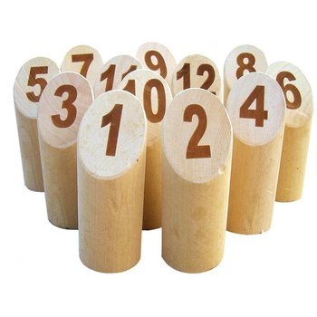

# Kata molkky

## Règles

le jeu comporte 12 quilles numérotées de 1 à 12

* si 1 quille est tombée, le joueur marque les points de la quille tombée
* si n quilles sont tombées, , le joueur marque le nombre de quilles tombées (si toutes les quilles tombent, le joueur marque donc douze points);
* si le score est exactement 50, le joueur remporte la partie
* si le score dépasse 50, le score du joueur redescend à 25
* si un joueur fait 3 lancers sans marquer de points, le joueur est éliminée

Exemples 

* un joueur vise la quille n°12 et la fait tomber seule, il marque 12 points.
* s’il fait tomber la n°12 et dans le même temps la n°4, il ne marque que 2 points.
 

#### Pour aller plus loin

* Une partie peut être jouée par 1 ou n joueurs
* Afficher le score en cours pour chaque joueur
* Afficher le détail de chaque lancer et le score total en cours pour chaque joueur 

## Méthodo

* TDD : Red / Green / Refactor
* Baby steps

## Langage

Au choix 

* Javascript 
* Java 

Example de boostrap: 
  
* [Javascript + mocha + chai](https://github.com/jrollin/vanilla-babel-mocha)
* [Java + junit5](https://github.com/jrollin/java-kata-bootstrap)
  
